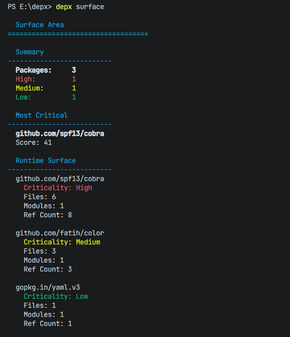
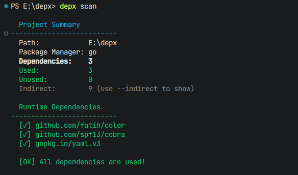

# depx

[](https://golang.org)
[](./LICENSE)

面向现代项目的依赖智能 CLI — 理解依赖风险、影响面与项目结构。

**English Documentation**: [README.md](README.md)

---

## 功能

- **影响面分析** — 理解依赖风险与影响。衡量每个依赖的使用广度（文件数、模块数、引用次数、关键度排名）
- **依赖智能** — 不只是告诉你"unused: lodash"。看到全貌：已用、未用、类型包、间接包 — 一目了然掌握项目结构
- **Lock File 分析** — 解析 lock 文件，展示传递依赖信息与共享间接依赖映射
- **配置支持** — 通过 `.depx.yml` 自定义忽略规则和排除目录

## 支持范围

| 包管理器 | 清单文件 | Lock File | 源文件 |
|---------|----------|-----------|--------|
| npm | package.json | package-lock.json | .js, .ts, .jsx, .tsx, .mjs, .cjs, .vue, .svelte |
| Go | go.mod | go.sum | .go |
| Rust | Cargo.toml | Cargo.lock | .rs |
| Python | requirements.txt | — | .py |

**暂不支持：** `yarn.lock`、`pnpm-lock.yaml`、`pyproject.toml`、`Pipfile`、npm/pnpm/yarn workspaces 子包清单（仅分析根目录 manifest）。

## 快速开始

```bash
git clone https://github.com/mukunjin/depx.git
cd depx
go build .
depx surface
depx scan
```

## 安装（Windows）

### 首次设置

Windows 默认禁止运行 PowerShell 脚本。请以**管理员身份**运行 PowerShell：

```powershell
Set-ExecutionPolicy -ExecutionPolicy RemoteSigned -Scope CurrentUser
```

### 通过脚本安装

```powershell
git clone https://github.com/mukunjin/depx.git
cd depx
.\build.ps1
.\install.ps1
```

### 卸载

```powershell
.\install.ps1 -Uninstall
```

安装脚本会：
- 将 `depx.exe` 复制到 `%LOCALAPPDATA%\depx`
- 添加到用户 PATH
- 通过 `depx --version` 验证安装

### 版本管理

| 位置 | 作用 | 生效时机 |
|------|------|----------|
| Git tag | 主要来源 | 通过 `.\build.ps1` 构建时 |
| `cmd/root.go` 第 8 行 | 回退值（`dev`） | 直接 `go build` 且不使用 `-ldflags` 时 |
| `build.ps1` | 读取 git tag，通过 `-ldflags` 注入 | 每次运行 `.\build.ps1` 时 |
| `install.ps1` 第 140 行 | 从二进制读取版本 | 安装验证时 |

**发布新版本：**
1. `git tag v0.3.0`
2. `git push origin v0.3.0`
3. `.\build.ps1`
4. `.\install.ps1`

## 使用方法

### `surface` vs `scan`

| | `depx surface` | `depx scan` |
|---|----------------|-------------|
| **用途** | 依赖风险 — 理解影响面与关键度 | 依赖智能 — 理解项目结构 |
| **范围** | 仅 `dependencies`（用 `--dev` 包含 dev） | `dependencies` + `devDependencies` |
| **输出** | 文件数、模块数、引用次数、关键度排名 | Runtime / Tool / Unused 列表 + 完整统计 |
| **间接依赖** | `--indirect` 显示共享传递依赖摘要 | `--indirect` 显示摘要，`--indirect-all` 显示全部 |
| **类型包** | 完全排除 | 单独统计 `@types/*` |

### 影响面分析

```bash
depx surface              # 仅 runtime 依赖
depx surface --dev        # 包含 devDependencies
depx surface -D
depx surface --indirect   # 共享传递依赖摘要
depx surface -i
```

输出示例：



**说明：**
- 默认分析 **runtime surface**（仅 `dependencies`）
- **Score** = `RefCount × 5 + Modules` — 简洁直观，无重复计权
- **Criticality** 采用**百分位排名** — Top 20% = High，Top 50% = Medium，其余 = Low。无论项目大小都有清晰的层次区分
- `--indirect` 显示传递依赖总数 + 被 **2 个以上** direct package 依赖的共享包
- 共享间接依赖图需要 `package-lock.json`（推荐 lockfile v2+）
- `@types/*` 完全排除

### Scan

```bash
depx scan
depx scan /path/to/project
depx scan --config /path/to/.depx.yml
depx scan --indirect    # 显示间接依赖摘要（总数 + Top Shared）
depx scan -i
depx scan --indirect-all  # 显示所有间接依赖
depx scan --types       # 显示 @types/* 包
depx scan -t
```

`scan` 同时检查 **`dependencies` 和 `devDependencies`** 在源代码中的使用情况。

输出示例：



**说明：**
- `@types/*` 包单独统计，不包含在 Runtime/Tool/Unused 列表中
- **Runtime Dependencies**：来自 `dependencies`（生产环境依赖）
- **Tool Packages**：来自 `devDependencies`（构建工具、测试框架等）
- 在 `.depx.yml` 中启用 `lock_file: true`（默认开启）可查看间接依赖数量

## 配置

在项目根目录创建 `.depx.yml`：

```yaml
ignore:
  - "@types/node"
  - "typescript"

exclude_dirs:
  - "vendor"
  - "dist"
  - "node_modules"

exclude_files:
  - "*.test.js"
  - "*.spec.ts"

read_node_modules: false
lock_file: true
```

| 配置项 | 默认值 | 说明 |
|--------|--------|------|
| `ignore` | `[]` | 跳过这些包的检测 |
| `exclude_dirs` | `node_modules`, `vendor`, `dist`, `build` | 跳过的目录名（basename） |
| `exclude_files` | `[]` | 跳过的文件 glob 模式 |
| `read_node_modules` | `false` | 是否扫描 `node_modules` |
| `lock_file` | `true` | 是否启用 lock file 分析 |

## 架构

```
depx
├── cmd/
│   ├── root.go                  # 根命令
│   ├── scan.go                  # 扫描子命令
│   ├── surface.go               # 影响面分析
│   └── config.go                # 配置加载辅助
├── internal/
│   ├── analyzer/                # 扫描编排
│   ├── config/                  # .depx.yml 解析
│   ├── filter/                  # 文件排除规则
│   ├── lockfile/                # Lock file 解析器
│   ├── manifest/                # 清单解析器（npm/go/cargo/pip）
│   ├── report/                  # 终端输出
│   ├── surface/                 # 影响面分析
│   └── usage/                   # 各语言 import 分析器
├── tests/                       # 集成测试
└── testdata/                    # 测试夹具
```

## 技术实现

- **语言**: Go 1.26+
- **CLI 框架**: cobra
- **输出着色**: fatih/color
- **YAML 解析**: gopkg.in/yaml.v3
- **依赖检测**: 正则匹配 + 状态机注释/字符串过滤

**核心流程：**

1. 检测项目类型（优先级：npm → go → cargo → pip）
2. 解析清单文件获取声明的依赖
3. 遍历源码提取 import
4. 匹配声明与使用情况
5. 可选解析 lock file 获取传递依赖
6. 生成终端报告

**清单检测：** 若存在多个清单文件（如 `package.json` + `go.mod`），npm 优先，仅分析 npm 依赖。

## 限制

- **使用检测**为静态分析 — 动态 import、反射、代码生成可能导致误报/漏报
- **scan** 检查 manifest 中的直接声明（`dependencies` + `devDependencies`）；**surface** 默认仅分析 runtime `dependencies`
- **间接依赖列表**（`scan --indirect`）来自 lock file，不追踪传递依赖在源码中的使用
- **共享间接依赖图**（`surface --indirect`）仅支持 npm `package-lock.json`
- **Workspaces** — 仅分析根目录 manifest，不递归分析 workspace 子包
- **npm `@types/*`** — scan 中单独统计；surface 中排除；通常不在源码中直接 import
- **Go `// indirect`** — 从 manifest 依赖列表中排除
- **Python** — 包名可能与 import 名不一致（如 `pip install Pillow` → `import PIL`）
- **exclude_dirs** 仅匹配目录 **basename**，不匹配完整路径

## 许可证

GPLv3 — 详见 [LICENSE](LICENSE)。
